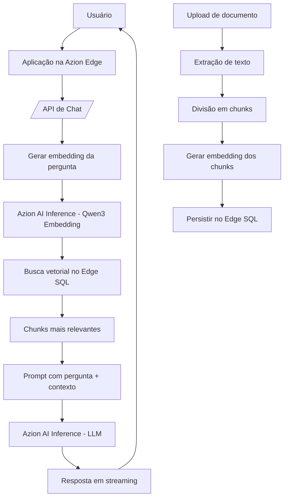

# Azion RAG Chat com AI Inference e Edge SQL

Este projeto demonstra uma arquitetura de **Retrieval-Augmented Generation (RAG)** executada na **Azion Edge**, utilizando **Azion AI Inference** para geração de embeddings e respostas em linguagem natural, e **Azion Edge SQL** como camada persistente para documentos, chunks, metadados e vetores.

O objetivo principal é permitir que uma aplicação consulte uma base de conhecimento própria e gere respostas contextualizadas, sem depender de infraestrutura externa tradicional para o fluxo principal de RAG.

---

## 1. Visão geral da solução

A solução combina quatro blocos principais:

| Camada | Função |
|---|---|
| **Aplicação na Azion Edge** | Executa a interface, APIs de ingestão, consulta e gerenciamento da base de conhecimento |
| **AI Inference - Embeddings** | Transforma textos e perguntas em vetores numéricos |
| **Edge SQL** | Armazena documentos, chunks, metadados e embeddings |
| **AI Inference - LLM** | Gera a resposta final em linguagem natural com base no contexto recuperado |

Fluxo resumido:

1. O cliente envia documentos para a base de conhecimento.
2. A aplicação extrai o texto desses documentos.
3. O texto é dividido em chunks.
4. Cada chunk é convertido em embedding.
5. Os chunks, metadados e embeddings são persistidos no Edge SQL.
6. O usuário faz uma pergunta.
7. A pergunta também é convertida em embedding.
8. O Edge SQL recupera os chunks semanticamente mais próximos.
9. O modelo de linguagem recebe a pergunta + contexto recuperado.
10. A resposta final é retornada ao usuário, com fontes e contexto consultado.

---

## 2. Por que usar RAG?

Um modelo de linguagem sozinho responde com base no conhecimento aprendido durante seu treinamento. Isso é útil para respostas gerais, mas não garante conhecimento sobre documentos internos, políticas, manuais, propostas, contratos, catálogos ou informações privadas da empresa.

O RAG resolve isso ao combinar:

| Recurso | Papel |
|---|---|
| **Base de conhecimento própria** | Documentos confiáveis enviados pelo cliente |
| **Busca semântica** | Recupera trechos relacionados à pergunta, mesmo com palavras diferentes |
| **LLM** | Gera uma resposta natural usando os trechos recuperados |
| **Fontes** | Permitem rastrear quais documentos foram usados na resposta |

Na prática, o modelo não “aprende permanentemente” o conteúdo dos documentos. Ele usa os documentos como **contexto temporário** no momento da resposta.

---

## 3. Arquitetura lógica



---

## 4. Componentes utilizados

### 4.1 Azion Edge Application

A aplicação roda na Azion Edge e concentra as rotas necessárias para:

- Receber perguntas do usuário.
- Executar a busca RAG.
- Retornar resposta em streaming.
- Fazer upload de documentos.
- Listar documentos indexados.
- Remover documentos da base de conhecimento.

Exemplos de rotas implementadas:

| Rota | Função |
|---|---|
| `/api/chat/stream` | Gera resposta em tempo real usando RAG ou LLM geral |
| `/api/ingest` | Ingestão direta de texto na base |
| `/api/knowledge/upload` | Upload de arquivos para a base de conhecimento |
| `/api/knowledge/list` | Lista documentos indexados |
| `/api/knowledge/delete` | Remove documentos da base |

---

### 4.2 Azion AI Inference

A solução utiliza dois tipos de modelo:

| Modelo | Função |
|---|---|
| **Qwen3 Embedding 4B** | Geração de embeddings para busca semântica |
| **Mistral Small** | Geração da resposta final em linguagem natural |

O modelo de embedding transforma textos em vetores. Esses vetores permitem comparar a pergunta do usuário com os trechos armazenados, encontrando os conteúdos mais próximos semanticamente.

Exemplo conceitual:

```txt
Pergunta:
"Como o RAG encontra informações mesmo com palavras diferentes?"

Chunk:
"A busca vetorial usa embeddings para recuperar trechos semanticamente próximos."

Resultado:
Alta similaridade, mesmo sem as palavras serem idênticas.
```

---

### 4.3 Azion Edge SQL

O Edge SQL é usado como camada persistente do RAG.

Ele armazena:

- Documentos enviados.
- Chunks extraídos dos documentos.
- Metadados dos documentos.
- Embeddings vetoriais.
- Informações de controle da base de conhecimento.

Tabelas recomendadas:

| Tabela | Função |
|---|---|
| `rag_documents` | Controle dos documentos enviados |
| `rag_chunks` | Armazena os trechos textuais |
| `rag_chunk_embeddings` | Armazena os vetores para busca semântica |

---

## 5. Estrutura de dados recomendada

### 5.1 Tabela de documentos

```sql
CREATE TABLE IF NOT EXISTS rag_documents (
  id TEXT PRIMARY KEY,
  filename TEXT NOT NULL,
  content_type TEXT NOT NULL,
  size_bytes INTEGER NOT NULL,
  status TEXT NOT NULL,
  created_at TEXT DEFAULT CURRENT_TIMESTAMP,
  updated_at TEXT DEFAULT CURRENT_TIMESTAMP
);
```

Essa tabela funciona como o índice administrativo da base de conhecimento.

Ela permite listar, controlar e remover documentos de forma organizada.

---

### 5.2 Tabela de chunks

```sql
CREATE TABLE IF NOT EXISTS rag_chunks (
  id TEXT PRIMARY KEY,
  source TEXT NOT NULL,
  chunk_index INTEGER NOT NULL,
  content TEXT NOT NULL,
  metadata TEXT,
  created_at TEXT DEFAULT CURRENT_TIMESTAMP
);
```

Cada documento é dividido em pequenos trechos. Esses trechos são usados como contexto para o modelo.

Exemplo:

```txt
Documento: manual-cloudlets.pdf

Chunk 0:
"Cloudlets App Platform Standard oferece throughput de disco..."

Chunk 1:
"Cloudlets App Platform Premium possui maior previsibilidade..."
```

---

### 5.3 Tabela de embeddings

```sql
CREATE TABLE IF NOT EXISTS rag_chunk_embeddings (
  chunk_id TEXT PRIMARY KEY,
  source TEXT NOT NULL,
  chunk_index INTEGER NOT NULL,
  content TEXT NOT NULL,
  embedding VECTOR(256),
  metadata TEXT,
  created_at TEXT DEFAULT CURRENT_TIMESTAMP
);
```

O campo `embedding VECTOR(256)` armazena o vetor gerado pelo modelo de embedding.

A dimensão precisa ser compatível com o parâmetro utilizado na chamada do modelo de embeddings.

---

## 6. Fluxo de ingestão

O fluxo de ingestão é responsável por transformar documentos em dados pesquisáveis.

### 6.1 Upload ou envio de texto

A aplicação pode receber conteúdo de duas formas:

| Entrada | Exemplo |
|---|---|
| Upload de arquivo | `.txt`, `.md`, `.html`, `.pdf` |
| Texto direto via API | JSON com `source` e `text` |

Exemplo de ingestão via API:

```bash
curl -X POST https://SEU_DOMINIO/api/ingest \
  -H "Content-Type: application/json" \
  -d '{
    "source": "manual-rag.txt",
    "text": "O RAG utiliza embeddings para buscar contexto relevante.",
    "chunkSize": 800,
    "overlap": 120,
    "generateEmbeddings": true
  }'
```

---

### 6.2 Extração de texto

Para arquivos simples como `.txt`, `.md` e `.html`, o conteúdo pode ser lido diretamente.

Para PDF, existem duas possibilidades:

| Estratégia | Observação |
|---|---|
| Extração no navegador | Útil para evitar limitações do runtime Edge |
| Extração no backend | Exige biblioteca compatível com o ambiente de execução |

Neste projeto, a extração de PDF pode ser feita no navegador antes do envio para a API de ingestão.

> PDFs escaneados ou baseados em imagem exigem OCR, o que não faz parte do fluxo principal.

---

### 6.3 Divisão em chunks

Após extrair o texto, a aplicação divide o conteúdo em partes menores.

Exemplo de configuração:

```json
{
  "chunkSize": 800,
  "overlap": 120
}
```

| Parâmetro | Função |
|---|---|
| `chunkSize` | Define o tamanho máximo de cada trecho |
| `overlap` | Mantém uma sobreposição entre chunks para preservar contexto |

A sobreposição evita perda de sentido quando uma informação importante fica dividida entre dois trechos.

---

### 6.4 Geração de embeddings

Cada chunk é enviado ao modelo de embeddings.

Exemplo de chamada:

```bash
curl -X POST "https://SEU_AI_ENDPOINT/v1/embeddings" \
  -H "Content-Type: application/json" \
  -H "X-API-Key: SUA_CHAVE" \
  -d '{
    "model": "Qwen/Qwen3-Embedding-4B",
    "input": "Texto do chunk que será transformado em vetor.",
    "encoding_format": "float",
    "dimensions": 256
  }'
```

Resposta esperada:

```json
{
  "object": "list",
  "model": "qwen-qwen3-embedding-4b",
  "data": [
    {
      "object": "embedding",
      "index": 0,
      "embedding": [0.0123, -0.0456, 0.0789]
    }
  ]
}
```

O vetor retornado é salvo no Edge SQL junto com o conteúdo original do chunk.

---

## 7. Fluxo de consulta

Quando o usuário faz uma pergunta, o processo é semelhante à ingestão, mas aplicado à pergunta.

### 7.1 Pergunta do usuário

Exemplo:

```txt
Como essa aplicação usa AI Inference e Edge SQL para implementar RAG?
```

### 7.2 Geração do embedding da pergunta

A pergunta é enviada ao mesmo modelo de embeddings usado na ingestão.

Isso garante que pergunta e documentos estejam no mesmo espaço vetorial.

---

### 7.3 Busca vetorial no Edge SQL

A aplicação compara o vetor da pergunta com os vetores armazenados.

O objetivo é recuperar os chunks mais próximos semanticamente.

Exemplo lógico:

```sql
SELECT
  chunk_id,
  source,
  chunk_index,
  content,
  vector_distance_cos(embedding, :question_embedding) AS distance
FROM rag_chunk_embeddings
ORDER BY distance ASC
LIMIT 4;
```

A query exata pode variar conforme a função vetorial disponível no ambiente.

---

### 7.4 Filtro de relevância

Nem todo resultado vetorial deve ser usado.

É importante aplicar um limite mínimo de score para evitar contexto incorreto.

Exemplo:

```ts
const VECTOR_TOP_K = 4;
const MIN_VECTOR_SCORE = 0.68;
```

| Parâmetro | Função |
|---|---|
| `VECTOR_TOP_K` | Quantidade máxima de chunks recuperados |
| `MIN_VECTOR_SCORE` | Score mínimo para considerar um chunk relevante |

Se nenhum chunk atingir o score mínimo, a aplicação pode responder como LLM geral, sem fontes da base.

---

## 8. Modos de resposta

A solução pode operar em dois modos.

### 8.1 Resposta com RAG

Esse modo é usado quando a busca vetorial encontra contexto relevante.

Características:

- Usa chunks recuperados do Edge SQL.
- Envia contexto para o modelo de linguagem.
- Retorna fontes utilizadas.
- Permite exibir o contexto recuperado.
- Reduz risco de resposta genérica ou desconectada da base.

Exemplo de retorno:

```json
{
  "mode": "edge-sql-vector-rag",
  "answer": "A aplicação usa AI Inference para gerar embeddings...",
  "sources": [
    {
      "source": "README.md",
      "chunkIndex": 2,
      "score": 0.91
    }
  ],
  "chunks": [
    {
      "source": "README.md",
      "content": "O RAG utiliza embeddings para recuperar contexto...",
      "score": 0.91
    }
  ]
}
```

---

### 8.2 Resposta geral

Esse modo é usado quando a busca vetorial não encontra contexto relevante.

Características:

- Não exibe fontes.
- Não inventa contexto.
- Responde como uma LLM normal.
- Informa que não encontrou contexto relevante na base.

Exemplo:

```txt
Não encontrei contexto relevante na base de conhecimento para essa pergunta.

Resposta geral:
...
```

Esse comportamento é importante para manter transparência. A aplicação continua útil, mas não finge que encontrou fonte quando não encontrou.

---

## 9. Prompt do modelo de resposta

O prompt do modelo precisa ser bem definido para evitar respostas genéricas.

Exemplo de system prompt para resposta com RAG:

```txt
Você é um especialista técnico em cloud, edge computing, RAG, bancos vetoriais e documentação técnica.

Responda usando somente o contexto recuperado da base de conhecimento.

Use dados, nomes, componentes, limites e detalhes concretos presentes no contexto.

A resposta deve estar em Markdown válido e bem formatado.

Se o contexto não tiver informação suficiente, diga isso claramente.

Não invente fontes, números ou capacidades que não estejam no contexto.
```

Exemplo de mensagem enviada ao modelo:

```txt
Pergunta do usuário:
{question}

Contexto recuperado:
{context}

Instruções:
- Responda diretamente a pergunta.
- Use Markdown válido.
- Use tabelas quando houver comparação.
- Destaque pontos importantes em negrito.
- Não mencione chunks ou embeddings, exceto se a pergunta for sobre o funcionamento do RAG.
```

---

## 10. Streaming de resposta

Para melhorar a experiência do usuário, a aplicação pode retornar a resposta em streaming.

Fluxo recomendado:

1. A API inicia uma resposta `text/event-stream`.
2. Envia um evento `meta` com modo, fontes e chunks.
3. Envia eventos `delta` conforme o modelo gera a resposta.
4. Envia um evento `done` ao finalizar.

Exemplo:

```txt
event: meta
data: {"mode":"edge-sql-vector-rag","sources":[...],"chunks":[...]}

event: delta
data: {"content":"A aplicação"}

event: delta
data: {"content":" usa AI Inference..."}

event: done
data: {"ok":true}
```

Na interface, recomenda-se:

- Renderizar texto simples enquanto a resposta está sendo gerada.
- Aplicar Markdown somente ao final.
- Exibir fontes e contexto recolhidos para não poluir a tela.

---

## 11. Gestão da base de conhecimento

A solução deve permitir uma gestão mínima da base.

Recursos recomendados:

| Recurso | Função |
|---|---|
| Upload | Enviar novos documentos |
| Listagem | Visualizar documentos indexados |
| Remoção | Remover documentos da base |
| Reindexação | Substituir documento por uma nova versão |

Formatos suportados neste projeto:

| Formato | Observação |
|---|---|
| `.txt` | Texto puro |
| `.md` | Markdown |
| `.html` / `.htm` | HTML convertido para texto |
| `.pdf` | Suportado quando possui texto selecionável |

Limite recomendado:

```txt
5 MB por arquivo ou payload
```

Esse limite evita payloads muito grandes e reduz risco de impacto na função Edge.

---

## 12. Variáveis de ambiente

Exemplo de variáveis utilizadas:

```env
AZION_PERSONAL_TOKEN=
EDGE_SQL_DATABASE_ID=

CHAT_API_URL=
CHAT_API_KEY=
CHAT_API_KEY_HEADER=X-API-Key
CHAT_MODEL=casperhansen-mistral-small-24b-instruct-2501-awq

EMBEDDING_API_URL=
EMBEDDING_API_KEY=
EMBEDDING_API_KEY_HEADER=X-API-Key
EMBEDDING_MODEL=Qwen/Qwen3-Embedding-4B

AZION_WORKLOAD_CERTIFICATE_ID=
```

| Variável | Função |
|---|---|
| `AZION_PERSONAL_TOKEN` | Token usado para chamadas à API da Azion |
| `EDGE_SQL_DATABASE_ID` | ID do banco Edge SQL |
| `CHAT_API_URL` | Endpoint de chat completions do AI Inference |
| `CHAT_API_KEY` | Chave de autenticação do endpoint de chat |
| `CHAT_MODEL` | Modelo usado para resposta final |
| `EMBEDDING_API_URL` | Endpoint de embeddings do AI Inference |
| `EMBEDDING_API_KEY` | Chave de autenticação do endpoint de embeddings |
| `EMBEDDING_MODEL` | Modelo usado para gerar embeddings |
| `AZION_WORKLOAD_CERTIFICATE_ID` | ID do certificado usado no Workload |

---

## 13. Passo a passo para implementar em outra aplicação

### Passo 1: Criar a base no Edge SQL

Crie um banco no Edge SQL e configure as tabelas:

1. `rag_documents`
2. `rag_chunks`
3. `rag_chunk_embeddings`

Garanta que a dimensão do campo vetorial seja compatível com o modelo de embeddings escolhido.

---

### Passo 2: Configurar AI Inference

Configure dois endpoints ou modelos:

| Tipo | Uso |
|---|---|
| Embeddings | Transformar texto em vetor |
| Chat completions | Gerar resposta final |

Valide primeiro os modelos com `curl`.

Teste de embedding:

```bash
curl -X POST "https://SEU_AI_ENDPOINT/v1/embeddings" \
  -H "Content-Type: application/json" \
  -H "X-API-Key: SUA_CHAVE" \
  -d '{
    "model": "Qwen/Qwen3-Embedding-4B",
    "input": "Teste de embedding",
    "encoding_format": "float",
    "dimensions": 256
  }'
```

Teste de chat:

```bash
curl -X POST "https://SEU_AI_ENDPOINT/v1/chat/completions" \
  -H "Content-Type: application/json" \
  -H "X-API-Key: SUA_CHAVE" \
  -d '{
    "model": "casperhansen-mistral-small-24b-instruct-2501-awq",
    "stream": false,
    "messages": [
      {
        "role": "user",
        "content": "Responda em uma frase o que é RAG."
      }
    ]
  }'
```

---

### Passo 3: Criar a rota de ingestão

A rota de ingestão deve:

1. Receber `source`, `text`, `chunkSize`, `overlap`.
2. Validar limite de payload.
3. Registrar o documento.
4. Dividir o texto em chunks.
5. Salvar chunks no Edge SQL.
6. Gerar embeddings.
7. Salvar embeddings no Edge SQL.

Exemplo de payload:

```json
{
  "source": "manual.txt",
  "text": "Conteúdo do documento...",
  "chunkSize": 800,
  "overlap": 120,
  "generateEmbeddings": true
}
```

---

### Passo 4: Criar a rota de consulta

A rota de consulta deve:

1. Receber a pergunta.
2. Gerar embedding da pergunta.
3. Buscar chunks similares no Edge SQL.
4. Filtrar por score mínimo.
5. Montar contexto.
6. Enviar pergunta + contexto para o LLM.
7. Retornar resposta, fontes e chunks.

---

### Passo 5: Implementar fallback sem RAG

Caso a busca vetorial não encontre contexto relevante:

1. Não envie contexto falso ao modelo.
2. Não retorne fontes.
3. Responda em modo geral.
4. Informe que não encontrou contexto relevante na base.

Isso evita que a aplicação pareça confiável usando fontes erradas.

---

### Passo 6: Habilitar streaming

Para uma experiência melhor:

1. Use `stream: true` na chamada ao modelo.
2. Retorne eventos SSE.
3. No frontend, exiba texto em tempo real.
4. Renderize Markdown apenas ao final.

---

### Passo 7: Criar gestão mínima da base

Implemente endpoints ou tela administrativa para:

- Upload de documento.
- Listagem de documentos.
- Remoção de documentos.
- Reindexação.

Essa gestão é essencial para uso real em cliente.

---

## 14. Boas práticas

### 14.1 Segurança

- Não exponha chaves do AI Inference no frontend.
- Use variáveis de ambiente ou secrets.
- Proteja endpoints administrativos.
- Aplique limite de tamanho no upload.
- Valide tipo de arquivo.
- Evite armazenar documentos sensíveis sem controle de acesso.

---

### 14.2 Qualidade do RAG

- Use chunks pequenos o suficiente para serem objetivos.
- Use overlap para preservar contexto.
- Ajuste `MIN_VECTOR_SCORE` conforme a qualidade das respostas.
- Mostre fontes utilizadas.
- Permita visualizar o contexto recuperado.
- Não use contexto irrelevante só para sempre responder com RAG.

---

### 14.3 Experiência do usuário

- Use streaming para reduzir percepção de espera.
- Mostre quando a resposta veio da base.
- Mostre quando a resposta é geral.
- Deixe fontes recolhidas por padrão.
- Formate respostas em Markdown.
- Não mostre chunks gigantes na tela principal.

---

## 15. Troubleshooting

### O modelo responde com contexto errado

Verifique:

- Score mínimo está baixo demais.
- Chunks estão grandes demais.
- Documento indexado contém conteúdo irrelevante.
- A pergunta é muito genérica.
- O fallback textual está ativo indevidamente.

Recomendação:

```ts
const VECTOR_TOP_K = 4;
const MIN_VECTOR_SCORE = 0.68;
```

---

### O modelo responde de forma genérica

Verifique:

- O prompt do sistema está fraco.
- Pouco contexto está sendo enviado.
- Os chunks recuperados não têm detalhes suficientes.
- O `max_tokens` está baixo.
- A base de conhecimento não contém informação específica.

---

### O Markdown aparece quebrado

Recomendações:

- Instrua o modelo a responder em Markdown válido.
- Renderize Markdown somente ao final do streaming.
- Normalize títulos comuns no frontend.
- Use tabelas Markdown reais com pipes.

---

### O upload de PDF não funciona

Verifique:

- O PDF possui texto selecionável.
- O arquivo não ultrapassa o limite de 5 MB.
- A extração está sendo feita no navegador ou em runtime compatível.
- PDFs escaneados exigem OCR.

---

### O certificado volta para Azion SAN após deploy

Isso pode acontecer quando o deploy faz PATCH no Workload sem preservar domínio/certificado.

Recomendação:

- Versione o Workload com o domínio correto.
- Informe o certificado correto em `tls.certificate`.
- Mantenha o ID do Workload existente no `azion/azion.json`.
- Não deixe `domains: []` no metadata local.
- Use secret para `AZION_WORKLOAD_CERTIFICATE_ID`.

Exemplo:

```js
tls: {
  certificate: workloadCertificateId,
  minimumVersion: 'tls_1_2'
}
```

---

## 16. Resultado esperado

Ao final da implementação, a aplicação deve ser capaz de:

- Receber documentos do cliente.
- Transformar documentos em chunks.
- Gerar embeddings.
- Persistir conhecimento no Edge SQL.
- Recuperar contexto semanticamente relevante.
- Responder com base nos documentos.
- Exibir fontes utilizadas.
- Responder em streaming.
- Diferenciar resposta com RAG de resposta geral.
- Rodar o fluxo principal na Azion Edge.

---

## 17. Conclusão

Essa arquitetura permite construir uma aplicação RAG usando recursos da Azion para executar o fluxo principal na Edge.

A combinação de **AI Inference**, **Edge SQL**, **Edge Application** e **streaming de resposta** cria uma base sólida para assistentes corporativos, consultas em documentação, suporte técnico, bases internas, catálogos, manuais e outros casos em que a resposta precisa ser contextualizada por documentos do cliente.

O frontend pode variar conforme o produto, mas o núcleo da solução é o mesmo:

```txt
Documento → Chunks → Embeddings → Edge SQL → Busca vetorial → Contexto → LLM → Resposta
```
